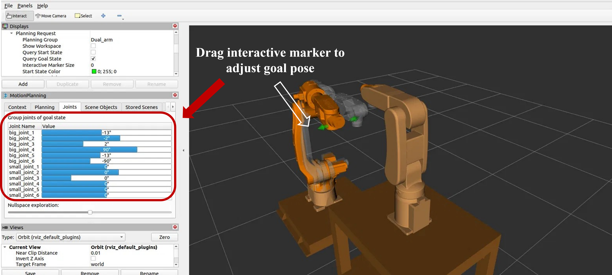

# <p align="justify"> HIWIN Dual-Arm Manipulator ROS 2 (Humble) Collision-Avoidance Path Planning User Manual </p>

<p align="justify">
This workspace ( <code>~/hiwin_ws/src/</code> ) contains a total of <b> 9 ROS 2 packages </b> : the robot description package <code>hiwin_dual_arm_description</code> , the MoveIt2 configuration package <code>hiwin_dual_arm</code> , the physical-hardware cross-domain bridge package <code>dual_arm_domain_bridge</code> , and 6 selectable dual-arm collision-avoidance planners. For the algorithmic derivations and parameter reference tables of each planner, please refer to their respective <code>README.md</code> and <code>PARAMETERS.md</code> files.
</p>

---

## 1. What This Workspace Does

<p align="justify">
The HIWIN dual-arm manipulators (Arm A, RA610-1476, and Arm B, RA605-710, mounted face-to-face at a separation of 1400 mm) share a common workspace, and the joint trajectories of the two arms may collide with each other. The purpose of this workspace is: given the respective start and goal joint angles of the two arms, to automatically plan a joint-space trajectory in which the two arms do not collide. The collision-avoidance algorithm is packaged as a <b> MoveIt2 planner plugin </b> and is used as the <code>planning_plugin</code> within <code>move_group</code>; during physical operation, the planned trajectory is then dispatched by the cross-domain bridge layer to the respective drive ends of the two arms for execution.
</p>

---

## 2. Package Overview

```
~/hiwin_ws/src/
├── hiwin_dual_arm/                  ← MoveIt2 configuration package + launch (non-algorithmic)
├── hiwin_dual_arm_description/      ← Dual-arm URDF/mesh description package (RA610-1476 + RA605-710 + base)
├── dual_arm_domain_bridge/          ← Physical cross-domain bridge (joint_states merging / trajectory action relay)
├── dual_arm_alm_newton_planner/     ┐
├── dual_arm_alm_cg_planner/         │  ALM series (Augmented Lagrangian)
├── dual_arm_alm_gd_planner/         ┘
├── dual_arm_lag_newton_planner/     ┐
├── dual_arm_lag_cg_planner/         │  Lagrangian series
└── dual_arm_lag_gd_planner/         ┘
```

<p align="justify">
The 6 planners all solve the same dual-arm collision-avoidance problem; they differ only in the mathematical model and solution method adopted by the inner optimization loop:
</p>

<table style="width:100%; table-layout: fixed;">
  <colgroup>
    <col style="width:22%;">
    <col style="width:26%;">
    <col style="width:26%;">
    <col style="width:26%;">
  </colgroup>
  <thead>
    <tr>
      <th align="justify"></th>
      <th align="justify">Newton</th>
      <th align="justify">CG (Conjugate Gradient)</th>
      <th align="justify">GD (Gradient Descent)</th>
    </tr>
  </thead>
  <tbody>
    <tr>
      <td align="justify"><b> ALM model </b></td>
      <td align="justify"><code>dual_arm_alm_newton_planner</code></td>
      <td align="justify"><code>dual_arm_alm_cg_planner</code></td>
      <td align="justify"><code>dual_arm_alm_gd_planner</code></td>
    </tr>
    <tr>
      <td align="justify"><b> Lagrangian model </b></td>
      <td align="justify"><code>dual_arm_lag_newton_planner</code></td>
      <td align="justify"><code>dual_arm_lag_cg_planner</code></td>
      <td align="justify"><code>dual_arm_lag_gd_planner</code></td>
    </tr>
  </tbody>
</table>

<p align="justify">
⚠️ ALM and Lagrangian are different mathematical models; their parameters must not be interchanged.
</p>

<p align="justify">
The 6 <code>dual_arm_*_planning.yaml</code> files under <code>hiwin_dual_arm/config/</code> each point <code>planning_plugin</code> to the corresponding <code>DualArmXxxPlannerManager</code> and supply that planner's parameters. MoveIt automatically scans and registers these as planning pipelines according to the filename convention ( <code>*_planning.yaml</code> ), so no separate manifest needs to be maintained.
</p>

---

## 3. Environment Setup (ROS 2 Humble; performed only once on a new machine)

> Tested environment: Ubuntu 22.04, ROS 2 Humble.

```bash
# ① Create the workspace and place this repo's 9 packages into src/
mkdir -p ~/hiwin_ws/src
cd ~/hiwin_ws/src
git clone https://github.com/dalletter2019-tech-Git/Double-arm_obstacle_avoidance.git .    # or simply copy the 9 package folders in directly

# ② Install dependencies (rosdep automatically installs moveit_*, Eigen3, etc., per each package.xml)
cd ~/hiwin_ws
sudo rosdep init            # if init was performed previously it will report an error, which can be ignored
rosdep update
rosdep install --from-paths src --ignore-src -r -y

# ③ Build the entire workspace
source /opt/ros/humble/setup.bash
colcon build --symlink-install
```

---

## 4. Physical Hardware Control Commands

<p align="justify">
The physical setup uses domain isolation: the host (planning end) and the two arm drive ends each reside on a different <code>ROS_DOMAIN_ID</code> , with <code>dual_arm_domain_bridge</code> responsible for the cross-domain connection—merging the <code>joint_states</code> of the two arms and handing them to the host, and relaying the trajectory and execution feedback of the <code>FollowJointTrajectory</code> action between domains:
</p>

```
D0   Host:   brain.launch.py (six planners + move_group + RViz)
D10  Arm A:  RA610-1476 drive (hiwin_driver)
D20  Arm B:  RA605-710  drive (hiwin_driver)
Bridge layer (runs on the host): joint_states merging + transparent FollowJointTrajectory action relay
```

> At the start of each terminal, first complete the **prerequisite** steps given at the beginning of that subsection (not repeated hereafter). Among these, `RMW_IMPLEMENTATION` must be identical on all three machines (a prerequisite for cross-machine communication); for `ROS_DOMAIN_ID`, first confirm the current value, then export it to the number required by that terminal.

### 4.1 Host Side (Planning + Bridging, Domain 0)

<p align="justify">
<b> Prerequisite </b> (at the start of each terminal):
</p>

```bash
source ~/hiwin_ws/install/setup.bash
echo $RMW_IMPLEMENTATION
echo $ROS_DOMAIN_ID
export ROS_DOMAIN_ID=0
```

<p align="justify">
<b> Terminal A — Planning End </b> :
</p>

```bash
ros2 launch hiwin_dual_arm brain.launch.py
```

<p align="justify">
<b> Terminal B — Bridge Layer </b> (trajectory action relay + joint_states merging):
</p>

```bash
ros2 launch dual_arm_domain_bridge bridge_relay.launch.py \
     host_domain:=0 arm_a_domain:=10 arm_b_domain:=20
```

<p align="justify">
Once the bridge is established, RViz's <b> Plan & Execute / Stop </b> can be used directly on the physical hardware (or on virtual hardware).
</p>

### 4.2 Arm Side

<p align="justify">
The arm controllers must, in advance, have hiwin_ros2 ( <code>hiwin_driver</code> ) installed under <code>~/ws_ros2</code> following HIWIN's official procedure (see §7).
</p>

<p align="justify">
<b> Prerequisite </b> (at the start of each terminal):
</p>

```bash
# First step: start EtherCAT
sudo /etc/init.d/ethercat start

# Second step: source the workspace and check the environment
source /opt/ros/humble/setup.bash
cd ~/ws_ros2
source install/setup.bash
echo $RMW_IMPLEMENTATION
echo $ROS_DOMAIN_ID
```

<p align="justify">
<b> Arm A (RA610-1476, Domain 10) </b> :
</p>

```bash
export ROS_DOMAIN_ID=10
taskset -c 2 ros2 launch hiwin_driver ra6_control.launch.py ra_type:=ra610_1476 cabinet:=ecat launch_rviz:=false
```

<p align="justify">
<b> Arm B (RA605-710, Domain 20) </b> : the command is the same as above, changing to <code>export ROS_DOMAIN_ID=20</code> and <code>ra_type:=ra605_710</code>.
</p>

<p align="justify">
<b> Release the safety relay </b> (after the driver has started, execute once under the domain of each corresponding arm):
</p>

```bash
# Perform once each for Arm A (D10) and Arm B (D20)
ros2 service call /gpio_controller/set_io hiwin_msgs/srv/SetIO \
     "{io_group: system, interface_name: reset_safety_rly, value: 1.0}"
```

### 4.3 Recommended Startup Order

```
① Arm A driver (D10) → ② Arm B driver (D20) → (release the safety relay for each)
→ ③ Bridge layer (D0) → ④ brain.launch.py (D0) → RViz planning/execution
```

---

## 5. Switching Planners

<p align="justify">
In the <b> MotionPlanning </b> panel on the left of RViz → <b> Context </b> tab → <b> Planning Library </b> drop-down menu, select one of the 6 <code>dual_arm_*</code> planners.
</p>

<p align="center"></p>

---

## 6. Setting the Start / Goal Joint Angles (required before running planning)

<p align="justify">
The planner requires both a "start" and a "goal" before it can compute a collision-avoidance trajectory; these are not set automatically after RViz launches and must be specified manually:
</p>


1. <p align="justify"><b> Start </b> : in the <b> Planning </b> tab's <b> Start State </b> drop-down menu, select <code>&lt;current state&gt;</code> so that the start is the current position. At the same time, under <b> Displays → Planning Request </b> , uncheck <b> Query Start State </b> , keeping only <b> Query Goal State </b> (see the screenshot below).</p>

2. <p align="justify"><b> Goal </b> : directly drag the marker in the 3D view to the desired goal pose, or adjust it to precise angles using the sliders on the <b> Joints </b> page (12 joints: <code>big_joint_1~6</code> , <code>small_joint_1~6</code> ).</p>

3. <p align="justify">Once both the start and goal are set, press <b> Plan </b>; upon successful planning, the 3D view plays the trajectory animation, and the elapsed time is printed in the log at the lower-left corner.</p>

<p align="justify">
<b> Built-in named poses </b> (the <code>group_state</code> entries in <code>dual_hiwin.srdf</code> , which can be selected directly from the Start/Goal State drop-down menu):
</p>

<table style="width: 100%; border-collapse: collapse; margin-top: 10px; margin-bottom: 10px; table-layout: fixed;">
  <colgroup>
    <col style="width:15%;">
    <col style="width:25%;">
    <col style="width:60%;">
  </colgroup>
  <thead>
    <tr>
      <th align="justify">Name</th>
      <th align="justify">Corresponding group</th>
      <th align="justify">Content</th>
    </tr>
  </thead>
  <tbody>
    <tr>
      <td align="justify"><code>Dual_ori</code></td>
      <td align="justify"><code>Dual_arm</code> (both arms)</td>
      <td align="justify">All 12 axes at 0 (Home pose)</td>
    </tr>
  </tbody>
</table>

<p align="justify">
Planning tab: set Start State to <code>&lt;current state&gt;</code> and uncheck <b> Query Start State </b>.
</p>

<p align="center"></p>

<p align="justify">
Joints page: adjust the target joint angles axis by axis using the sliders; this and dragging the marker are two methods that can be used in combination.
</p>

<p align="center"></p>

---

## 7. HIWIN Official ROS 2 Humble Libraries

<p align="justify">
This project is used in conjunction with HIWIN's official driver libraries:
</p>

<table style="width:100%; table-layout: fixed;">
  <colgroup>
    <col style="width:25%;">
    <col style="width:75%;">
  </colgroup>
  <thead>
    <tr>
      <th align="justify">Library</th>
      <th align="justify">Description</th>
    </tr>
  </thead>
  <tbody>
    <tr>
      <td align="justify"><a href="https://github.com/HIWINCorporation/hiwin_ros2">hiwin_ros2</a></td>
      <td align="justify">The official primary ROS 2 Humble library, providing the <code>ros2_control</code> hardware interface and MoveIt2 integration, supporting the RA6/RS4 series, and switchable between simulation and physical hardware. The two arms in this project are driven by this package (the <code>hiwin_driver</code> in §4 of this manual originates from this library).</td>
    </tr>
    <tr>
      <td align="justify"><a href="https://github.com/HIWINCorporation/hiwin_robot_client_library">hiwin_robot_client_library</a></td>
      <td align="justify">An interface library encapsulating low-level communication with the robot controller, called by <code>hiwin_ros2</code>.</td>
    </tr>
    <tr>
      <td align="justify"><a href="https://github.com/HIWINCorporation/hiwin_ros">hiwin_ros</a></td>
      <td align="justify">The legacy ROS 1 library (not ROS 2).</td>
    </tr>
  </tbody>
</table>

<p align="justify">
This workspace's <code>hiwin_dual_arm_description</code> uses the <code>hiwin_description</code> package from the official libraries listed above; the remaining packages were developed with reference to the arm control packages of HIWIN's hiwin_ros2.
</p>

---

## 8. License

<p align="justify">
Each package is licensed as noted in its <code>package.xml</code>; for the provenance of derived content in <code>hiwin_dual_arm_description</code> , see that package's <code>NOTICE</code>.
</p>
